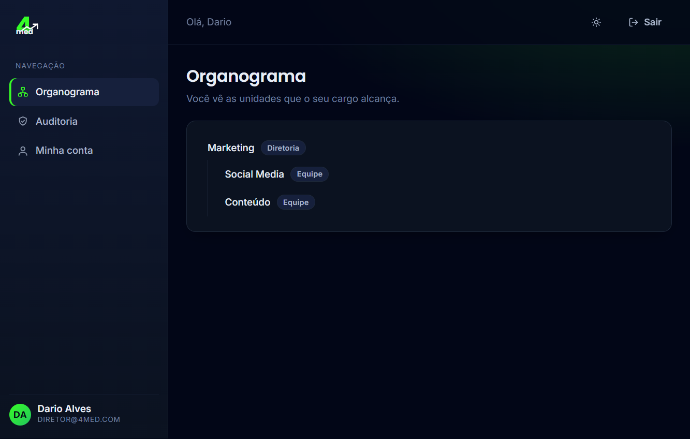
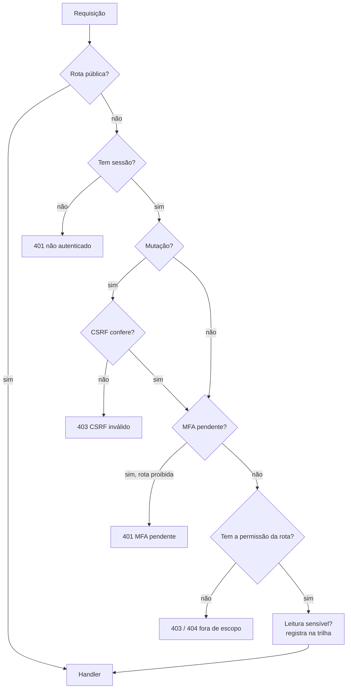

# orgcore

[](https://github.com/LeonardoPCavalcanti/orgcore/actions/workflows/ci.yml)

**Núcleo de uma intranet corporativa modular** — identidade, autorização por organograma e trilha de auditoria, para uma organização única. Concebido como protótipo de intranet corporativa, mas construído como produto real: front e back separados, contratos tipados compartilhados e um sistema de módulos sobre o qual novas áreas (Pessoas, Documentos, Tarefas, Conteúdo) entram sem tocar no núcleo.

Não é um SaaS multiempresa. É a fundação de acesso e auditoria de uma empresa só — a camada em que todo o resto se apoia.



---

## Destaques

- **Autorização derivada do organograma.** Papéis concedem permissões com um *alcance* (`próprio` / `subárvore` / `global`) resolvido sobre a árvore de unidades (materialized path). "Mais amplo vence" quando dois papéis colidem; cada permissão carrega o conjunto exato de unidades em que vale.
- **Segurança levada a sério, não decorativa.** Senhas com Argon2id, segundo fator TOTP *imposto pelo servidor*, defesa em duas camadas contra força bruta no MFA, CSRF de dupla submissão, sessões com renovação deslizante e revogação, e a regra de que recurso fora do escopo responde **404 — nunca 403** (não confirma sequer a existência do que você não pode ver).
- **Trilha de auditoria imutável.** *Append-only* garantido por gatilho no banco: nem o dono da aplicação apaga ou altera uma linha da trilha. Leituras sensíveis (quem lê a auditoria) entram na própria trilha.
- **Sistema de módulos com manifestos.** Cada módulo declara rotas, permissões e itens de menu num manifesto; o boot **falha** diante de qualquer inconsistência (rota sem decisão de acesso, permissão duplicada, caminho sem par). Erro de configuração vira falha de inicialização, nunca comportamento estranho em produção.
- **O front não decide autorização.** A UI só desenha o que o servidor já limitou pelo escopo — inclusive o menu, derivado das permissões efetivas e entregue pronto pela API.
- **Portátil por construção.** Postgres puro, sem extensões, para rodar em qualquer hospedagem. Tudo sobe com um `docker compose`.

---

## Arquitetura

Monorepo pnpm com três pacotes e uma fronteira de tipos entre o front e o back:

```
contracts/   Esquemas Zod + tipos compartilhados (a fonte da verdade dos contratos da API)
api/         Node + Fastify + Drizzle. Núcleo: auth, RBAC, organograma, auditoria, módulos
web/         React + Vite. Shell, roteamento, telas; consome os contracts
```

O acesso ao banco é confinado a um único arquivo (`api/src/core/db/client.ts`) — uma regra de lint impede que qualquer outro módulo importe o driver do Postgres direto.

Toda requisição não pública passa por um **portão único** (preHandler) antes de chegar ao handler:



---

## Stack

| Camada | Tecnologias |
|--------|-------------|
| Front  | React 18, Vite, TypeScript |
| Back   | Node 22, Fastify 5, Drizzle ORM, TypeScript |
| Contratos | Zod (esquemas e tipos compartilhados) |
| Banco  | PostgreSQL 16 (sem extensões) |
| Segurança | Argon2id, TOTP (otplib), CSRF de dupla submissão |
| Testes | Vitest (unidade/integração), Playwright (E2E) |
| Qualidade | TypeScript estrito, ESLint |

---

## Decisões de projeto

Algumas escolhas que definem o caráter do núcleo:

- **Fuso da organização, não do servidor.** Vigência de vínculos e delegações é comparada em `America/Sao_Paulo`, não na meia-noite de onde o banco por acaso estiver. Um vínculo que começa "hoje" começa à meia-noite daqui — não três horas antes, no fim do expediente.
- **Delegação temporária de escopo.** Uma pessoa pode emprestar o *próprio* alcance a outra por um período, com revogação e rastro na trilha. A invariante "no máximo uma delegação viva por destinatário" é mantida por lock de linha na transação — sem depender de extensão do Postgres.
- **MFA imposto no servidor.** Quem tem verbo sensível (aprovar, administrar, excluir) ou alcance global passa a exigir segundo fator; a checagem vive no servidor, não numa flag do cliente.
- **Escopo em toda tabela de domínio.** Cada registro carrega sua unidade, para que a autorização por organograma (hoje na aplicação) possa migrar para o banco (RLS) sem mudar o modelo de dados.

---

## Qualidade e testes

- **200** testes de API (unidade + integração contra um Postgres real), **6** de contratos, **18** de front e **3** de ponta a ponta no navegador (Playwright).
- Uma **matriz de autorização** derivada dos manifestos é a suíte crítica: para cada permissão declarada, ela exige um caso que prove quem acessa e quem é barrado — permissão sem teste não passa no CI.
- `pnpm test` roda `typecheck` + `lint` + todas as suítes.

```bash
pnpm test                              # typecheck + lint + contracts + api + web
pnpm --filter @4med/web exec playwright test   # ponta a ponta (sobe api e web sozinho)
```

---

## Como rodar localmente

Pré-requisitos: **Node 22+**, **pnpm** e **Docker**.

```bash
# 1. Banco (Postgres 16 em container, porta 5433)
pnpm banco            # = docker compose up -d postgres

# 2. Variáveis de ambiente da API
cp api/.env.example api/.env

# 3. Dependências
pnpm install

# 4. Dados de demonstração (organograma fictício + 4 acessos)
pnpm --filter @4med/api run seed

# 5. Subir API (:3333) e front (:5173), em dois terminais
pnpm --filter @4med/api dev
pnpm --filter @4med/web dev
```

Abra `http://localhost:5173`.

### Credenciais de demonstração

Todas usam a senha **`demonstracao conect2ai 2026`**. Cada uma enxerga um recorte diferente do organograma:

| E-mail | Cargo | Alcance |
|--------|-------|---------|
| `aluno@conect2ai.com` | Aluno | próprio (só a equipe dele) |
| `supervisor@conect2ai.com` | Supervisor | subárvore |
| `admin@conect2ai.com` | Administrador | subárvore de Marketing (não vê Comercial) |
| `secretaria@conect2ai.com` | Secretaria | global |

Abra dois navegadores lado a lado (o analista e o diretor) para ver a diferença de escopo na prática.

---

## Estrutura do repositório

```
contracts/           Esquemas Zod e tipos compartilhados
api/
  src/core/
    auth/            login, sessões, MFA, senha, convites
    rbac/            contexto de permissões, escopo, delegações
    organograma/     árvore de unidades (materialized path)
    auditoria/       trilha append-only
    modulos/         manifestos e validação de boot
    db/              cliente, migrations, fuso
  src/seed/          dados de demonstração
  tests/             unidade, integração e a matriz de autorização
web/
  src/shell/         sessão, navegação, layout, tema, roteador
  src/paginas/       organograma, auditoria, sessões, minha conta, login
  e2e/               Playwright
```

---

## Escopo e roadmap

Este repositório é o **núcleo**. Sobre ele, o produto cresce em módulos independentes, cada um com sua própria especificação:

1. **Núcleo** — auth, organograma, cargos/papéis, autorização, auditoria, módulos ✅
2. Pessoas · 3. Documentos · 4. Tarefas · 5. Conteúdo · 6. Publicação

Antes de qualquer dado real de colaborador, há um checklist de produção (segredo de cookie, papel de banco sem posse das tabelas, HTTPS com cookie `secure`, provedor de e-mail transacional, anonimização de desligados). O protótipo não vira produção sozinho — e o repositório é explícito sobre isso.
